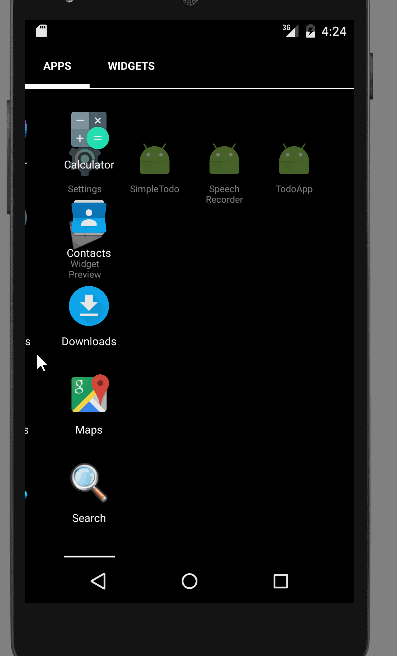

# Android-TodoApp
First version completed 
--------------------------------------------------------------- 
Android Bootcamp Project 0: Todo application  
--------------------------------------------------------------- 
(basic interface) 
This application contain one screen which mean a single Activity ✓  
You can add and remove items successfully ✓ 
Easily display the contents of the list ✓ 
Easily save list of items in a text file automatically after adding ✓ 
You can see all list of items on app resart ✓ 
Project contains a GIF walkthrough of the app's functionality ✓ 
Add edit functionality to todo app ✓ 
Submit todo app for review via Github ✓ 
Extend your todo app, improve UI, add features 

